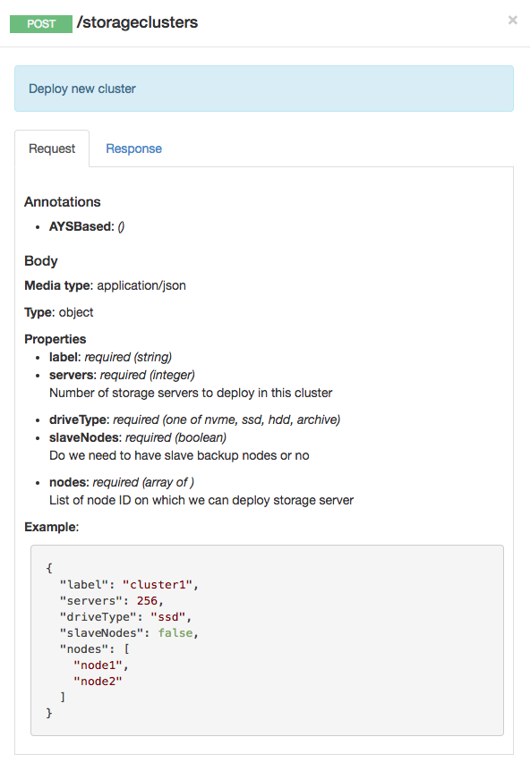
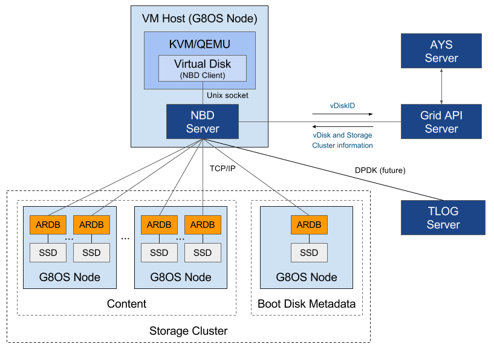

# G8OS Storage Cluster

A G8OS grid typically includes one or more storage clusters.

Setting up a storage cluster is achieved through the Grid API exposed by the Grid Server. So you first need to setup a G8OS Grid, as documented in [G8OS Grid Setup](setup/setup.md). Once the Grid is setup, following storage cluster API endpoint is exposed by the Grid Server:

Clicking **Post** will show you the details:

So the arguments to pass are:
- **label**: name the storage cluster
- **servers**: number of ARDB server to instantiate
- **driverType**: type of disk to use
- **slaveNodes**: if set to true, half of the available disks will be used as master, the other as slave
- **nodes**: list of the nodes where the disks should be found

In the example shown above you will end up with a cluster of 256 ARDB servers using all SSDs in node1 and node2. So If each node has 6 SSDs that are not yet used, then you'll get 12 disk, used by 256 ARDBs. What will actually happen is that for each free SSD a new storage pool will be created. So each storage pool then includes on SSD disk that gets formatted with a BTRFS file system.

The storage cluster is used by:
- [NBD Servers](#nbd)
- [TLOG Servers](tlog)
- [NAS Servers](nas)
- [S3 Servers](s3)

## NBD Servers

NBD, abbreviation for Network Block Device, is the lightweight block access protocol used in a G8OS grid to implement block storage.

A NBD Server actually implements the NBD protocol. For each virtual machine that needs block storage one NBD Server is required.

Each of these NBD Severs, or volume driver servers, runs in a container, and depend on another container that implements the TLOG Server.

## TLOG Servers

- Compresses and encrypts
- Cuts files of +1MB in file parts of <1MB (SCO's)
- Stores data to G8OS ObjStor (HDD)
- Stores metadata into GIG Directory Service
- Puts the hashes to the block chain

## NAS Servers

## S3 Servers
